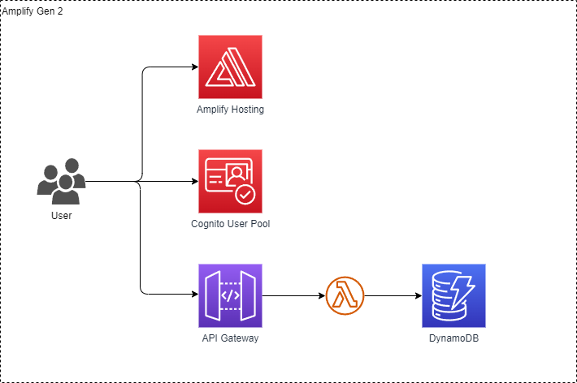

# Todo API

- [API仕様書](./doc/api.yaml)

- アーキテクチャ


## 動作確認

<https://main.d29gh21gyaw6hg.amplifyapp.com/> からログイン

## 動作確認(powershell版)

- AWS Cognitoからアクセストークンを取得

```powershell
# Cognitoからアクセストークンを取得
$authResult = aws cognito-idp admin-initiate-auth `
  --user-pool-id <user-pool-id> `
  --client-id <client-id> `
  --auth-flow ADMIN_USER_PASSWORD_AUTH `
  --auth-parameters USERNAME=<username>,PASSWORD=<password> | ConvertFrom-Json

$accessToken = $authResult.AuthenticationResult.AccessToken
```

### Todo登録

#### リクエストボディ

```powershell
$body = @{
    "title" = "New Todo"
    "content" = "test"
} | ConvertTo-Json

Invoke-RestMethod -Uri "https://x5p1ympye3.execute-api.ap-northeast-1.amazonaws.com/todo" `
  -Headers @{ Authorization = "Bearer $accessToken"; "Content-Type" = "application/json" } `
  -Method Post `
  -Body $body
```

### Todo一覧取得

```powershell
Invoke-RestMethod -Uri "https://x5p1ympye3.execute-api.ap-northeast-1.amazonaws.com/todo" `
  -Headers @{ Authorization = "Bearer $accessToken"; "Content-Type" = "application/json" } `
  -Method Get
```

### Todo更新

```powershell
$id = "01J75PMS957EB2QPK28C9AB22V"
$updateBody = @{
    "title" = "Updated Todo"
    "content" = "Completed"
} | ConvertTo-Json

Invoke-RestMethod -Uri "https://x5p1ympye3.execute-api.ap-northeast-1.amazonaws.com/todo/$id" `
  -Headers @{ Authorization = "Bearer $accessToken"; "Content-Type" = "application/json" } `
  -Method Put `
  -Body $updateBody
```

### Todo削除

```powershell
# 削除したいTodoのIDを指定
$id = "01J75PMS957EB2QPK28C9AB22V"

Invoke-RestMethod -Uri "https://x5p1ympye3.execute-api.ap-northeast-1.amazonaws.com/todo/$id" `
  -Headers @{ Authorization = "Bearer $accessToken" } `
  -Method Delete
```

### Todo検索

```powershell
# クエリパラメータの設定
$searchField = "content"  # contentまたはtitleを指定
$query = "test"           # 検索したいワード
$queryParams = "?searchField=$searchField&query=$query"

Invoke-RestMethod -Uri "https://x5p1ympye3.execute-api.ap-northeast-1.amazonaws.com/todo/search$queryParams" `
  -Headers @{ Authorization = "Bearer $accessToken" } `
  -Method Get
```
